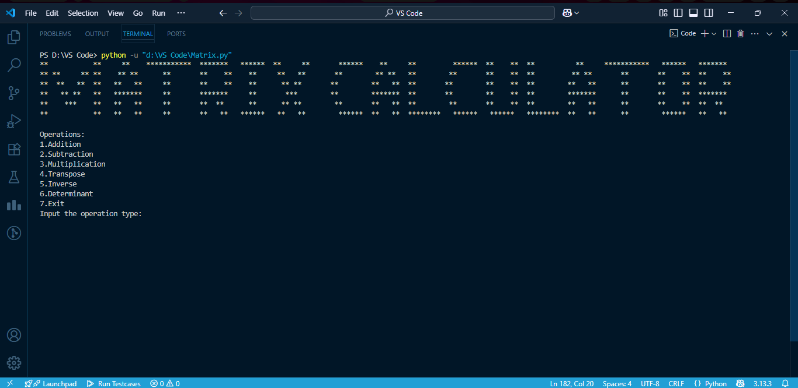

# 🧮 Matrix Calculator

A comprehensive Python-based matrix calculator that performs various matrix operations with robust error handling and user-friendly interface.

## 📋 Table of Contents
- [Overview](#overview)
- [Features](#features)
- [Technologies Used](#technologies-used)
- [Installation](#installation)
- [Usage](#usage)
- [Supported Operations](#supported-operations)
- [Screenshot](#screenshots)
- [Project Structure](#project-structure)
- [Error Handling](#error-handling)
- [Author](#author)

## 🔍 Overview

Matrix Calculator is a Python application designed to perform essential matrix operations efficiently and accurately. Built with a focus on code structure and user experience, this calculator handles various matrix computations while providing comprehensive error handling for invalid inputs.

## ✨ Features

- **Multiple Matrix Operations**: Addition, subtraction, multiplication, inverse, transpose, and determinant calculation
- **Robust Error Handling**: Comprehensive validation for invalid inputs and edge cases
- **User-Friendly Interface**: Clean and intuitive command-line interface
- **Structured Codebase**: Well-organized and maintainable code architecture
- **NumPy Integration**: Leverages the power of NumPy for efficient matrix computations

## 🛠️ Technologies Used

- **Python 3.x**: Core programming language
- **NumPy**: Primary library for matrix operations and numerical computations
- **os**: Operating system interface utilities (e.g. clearing screen)

## 📥 Installation

1. **Clone the repository**:
   ```bash
   git clone https://github.com/KrishnoMD305/Matrix-Calculator.git
   cd Matrix-Calculator
   ```

2. **Install required dependencies**:
   ```bash
   pip install numpy
   ```

3. **Run the application**:
   ```bash
   python main.py
   ```

## 🚀 Usage

1. Launch the application by running the main Python file
2. Follow the on-screen prompts to select your desired matrix operation
3. Input your matrix values as requested
4. View the calculated results

## 🧮 Supported Operations

### Basic Operations
- **Matrix Addition**: Add two matrices of the same dimensions
- **Matrix Subtraction**: Subtract one matrix from another
- **Matrix Multiplication**: Multiply two compatible matrices

### Advanced Operations
- **Matrix Inverse**: Calculate the inverse of a square matrix (if it exists)
- **Matrix Transpose**: Find the transpose of any matrix
- **Determinant**: Calculate the determinant of a square matrix

## 📸 Screenshot

### Application Interface

*First appearance of the Matrix Calculator after running the code*

## 📁 Project Structure

```
Matrix-Calculator/
│
├── main.py                # Main application file
├── Interface.png          # Interface of the program
├── README.md              # Project documentation
```

## ⚠️ Error Handling

The application includes comprehensive error handling for various scenarios:

- **Invalid Matrix Dimensions**: Checks for compatible matrix sizes before operations
- **Non-Numeric Input**: Validates that all matrix elements are numbers
- **Singular Matrix**: Handles cases where matrix inverse cannot be calculated
- **Empty Input**: Manages empty or null matrix inputs
- **Division by Zero**: Prevents mathematical errors in calculations

## 👨‍💻 Author

**Krishno Mondol**
- Computer Science and Engineering Student
- Khulna University of Engineering & Technology
- GitHub: [@KrishnoMD305](https://github.com/KrishnoMD305)

---

⭐ **If you found this project helpful, please consider giving it a star!** ⭐
